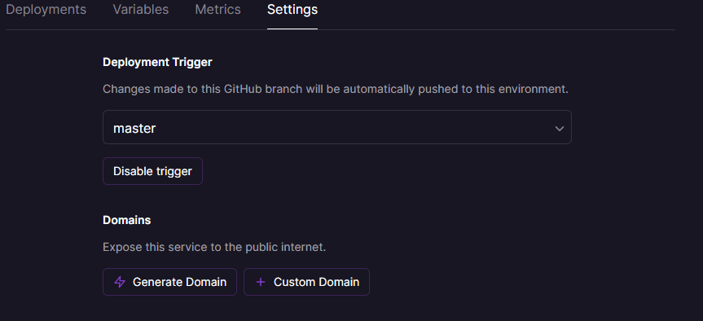

<h1 align="center">ekatra.one</h1>

🏠[Homepage](https://github.com/vruksheco/ekatraone)


• [**Ekatra**](https://www.ekatra.one/) is the first low data / no data learning platform. 

• Ekatra helps institutions create, deploy, and assess text message-based micro-courses that dramatically improve learning and training. 

• Our learning platform helps such organizations focused on career readiness for underserved high schoolers to teach them important job and life skills

• Learn more about Ekatra here: https://www.ekatra.one/  

---

<h1 align="center">Welcome to Ekatra Telegram ChatBot 👋</h1>
<p>
  
  <a href="https://github.com/ramshashaikh/ta-v2#readme" target="_blank">
    
  </a>
  <a href="https://github.com/ramshashaikh/ta-v2/graphs/commit-activity" target="_blank">
    
  </a>
  <a href="https://github.com/ekatraone/Ekatra-Telegram-ChatBot/blob/main/LICENSE" target="_blank">
    
  </a>
  <a href="https://twitter.com/ramshaa_shaikh" target="_blank">
    
  </a>
    <a href="https://twitter.com/ekatraone" target="_blank">
    
  </a>
</p>

> The Ekatra Telegram bot is a Node.js-powered interactive chatbot that assists you in deploying courses on WhatsApp.
>
> Every day, the Chatbot give access to new course modules by sending a reminder template message to students.
>
> This Chatbot offers an excellent learning experience on our preferred platform Telegram and allows students to learn at their own speed..

### ✨ Demo

### **Try WomenWill Telegram Bot:**

<p align="center"><a href="https://t.me/ekatra_telegram_bot"></a>

</p>


## Tech Stack


1. [**node-telegram-bot-api**](https://github.com/yagop/node-telegram-bot-api) : It is Node.js module to interact with the official Telegram Bot API.

2. [**Airtable**](https://support.airtable.com/hc/en-us) :  Airtable is an easy-to-use online platform for creating and sharing relational databases.
It is a spreadsheet-database hybrid which lets you create powerful databases that can be used to power custom applications.
Airtable has two APIs:
    * [REST API](https://support.airtable.com/hc/en-us/sections/360009623014-API)
    * [Metadata API](https://airtable.com/api/meta)
    

3. [**Railway**](https://railway.app/) : Railway is a platform for deployment where you can set up infrastructure, work with it locally, and then deploy to the cloud.
----
## Prerequisites
1. [WATI Account](https://app.wati.io/register)
2. [Airtable Account](https://airtable.com/signup)
3. [Railway Account](https://railway.app/) [or any other cloud platform of your choice]
---
## Initial Steps : Obtain required API Keys and Access Tokens  🔑

A. *Airtable REST API* 

1. Go to your [account page](https://airtable.com/account)
2. Under API heading in Account Overview page, click **Generate API key button**.
3. Securely save them in your .env file.

B. *Creating new bot with BotFather*
1. Send [@BotFather](https://t.me/botfather) a `/newbot` message
2.	Pick name and username.
3.	Receive and save the BOT_TOKEN

---
## Let's discuss about our backend - Airtable.
#### Head over to [Airtable Documentation](./docs/Airtable.md) to understand tables schema, field description.
---
## What is *node-telegram-bot-api* module?

Before discussing the module, Let's discuss what are Telegram Bots

* Bots are third-party applications that run inside Telegram. Users can interact with bots by sending them messages, commands and inline requests. You control your bots using HTTPS requests to Telegram's Bot API.

* Learn more about [Telegram Bot](https://core.telegram.org/bots)

* Learn more about [Telegram Bot API](https://core.telegram.org/bots/api)

Now to answer the question of this section.
* node-telegram-bot-api is Node.js module to interact with the official Telegram Bot API.

    ```sh
    npm i node-telegram-bot-api
    ```
* Refer this beginner's guide for more information: https://github.com/hosein2398/node-telegram-bot-api-tutorial
* Available methods and Error handling: https://github.com/yagop/node-telegram-bot-api/blob/master/doc/usage.md
---

# Configuring webhooks. 

* Webhooks are used to alert you on an incoming message via a callback URL.

  How do we obtain this URL?🤔

  There are two ways to get webhook server URLs.

  **1. For testing locally**
    
    a. Download [ngrok](https://ngrok.com/download)
  
  b. Start ngrok.exe and execute the following command:

      ```sh
      ngrok.exe http 7000
      ```
  c. Copy the https link and replace it as the SERVER_URL environment variable in .env variable.
  
    **2. For remote testing**
    
    a. Create a github repository for the bot.
  
    b. Sign up or login to your [railway.app](https://railway.app/) account
 
    c. Create a new project and select *Deploy from GitHub repo* > &emsp;&emsp; *Configure Github app* and link your bot github repository. 

    d. Click on *Deploy Now*.

    e. After successfully deploying your project, Click on the newly created Service Environment > go to *Settings*, under Domains heading click on _Generate Domain_. > Copy the URL

    f. Go to variables and add your environment variables from .env and set SERVER_URL to the generated domain url.
  
    


5. When a message is received, a callback happens on your webhook URL with the a payload

---
## ChatBot Flow

This section flow of chatbot.
1. To subscribe to the chatbot send `/start` command.
2. Now schedule template messages to initiate the course content by implementing the cron job described in the [Schedule Template Message](https://github.com/ekatraone/schedule-template-messages) repository.
3. When a **Start** keyword is received from the template message, the bot begins sending the course content where the learner left off.

Look at the [flowchart](./docs/Output/telgeram.jpg) to understand how the bot works.

---
## Congrats! 🤖🎉

The bot is up and running. 

---

## Author

👤 **Ramsha Shaikh**

* Twitter: [@ramshaa_shaikh](https://twitter.com/ramshaa_shaikh)
* Github: [@ramshashaikh](https://github.com/ramshashaikh)
* LinkedIn: [@ramsha-shaikh](https://www.linkedin.com/in/ramsha-shaikh/)

🏢 **Ekatra Learning, Inc.**
* Website: https://www.ekatra.one/
* Twitter: [@ekatraone](https://twitter.com/ekatraone)
* Github: [@ekatraone](https://github.com/ekatraone)

## 🤝 Contributing

If you have any suggestion on how to improve the code create a [PR request](https://github.com/ekatraone/Ekatra-Telegram-ChatBot/pulls) or faced any issues feel free to [contact me](https://github.com/ekatraone/Ekatra-Telegram-ChatBot/issues).

## Show your support

Give a ⭐️ if this project helped you!

## 📝 License

Copyright © 2022 [Ramsha Shaikh](https://github.com/ramshashaikh).<br />
This project is [MIT](https://github.com/ekatraone/Ekatra-Telegram-ChatBot/blob/main/LICENSE) licensed.

***
_This README was generated with ❤️ by [readme-md-generator](https://github.com/kefranabg/readme-md-generator)_
