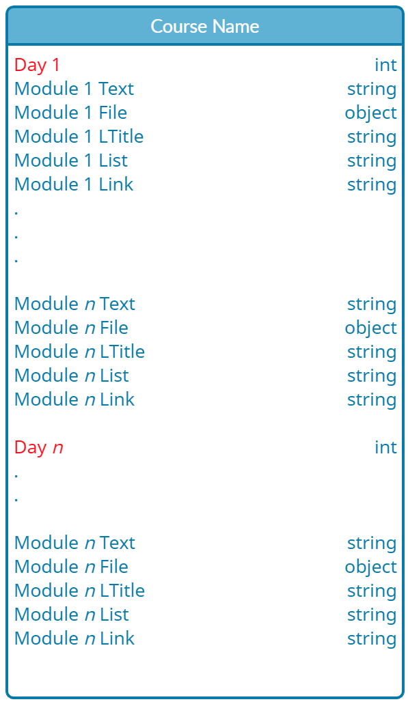

We have two tables
1. **Course Table**: 
- This table stores course content for each day.
- You can have _n_ numbers of modules in each day .
    
    **Fields Description:**

    a. Day _(Required)_: Day number.

    b. Module _n_ Text _(Required)_: Day content.

    c. Module _n_ File _(Optional)_: Supports multiple files attachments

    d. Module _n_ LTitle _(Optional)_: Title of the list message.

    e. Module _n_ List _(Optional)_: Options for the list message.
    Each new line (\n) is parsed as a new option.
    
    

    f. Module _n_ Link _(Optional)_: Useful links.

2. **Student Table** : Stores the students information.

    

    **Fields Description:**
    
    _Note: All the fields are required._

    a. CHatID : Chat id of the student.

    b. Name: Name of the student.

    c. Course : Name of the course enrolled by the student.

    d. Module Completed: 
    - Default value 0
    - Number of the last module completed by the student.

    e. Next Module: 
    - Default value 1
    - Number of the current/ongoing module.

    f. Day Completed: 
    - Default value 0
    - Number of the last day completed by the student.

    g. Next Day: 
    - Default value 1
    - Number of the current/ongoing day.